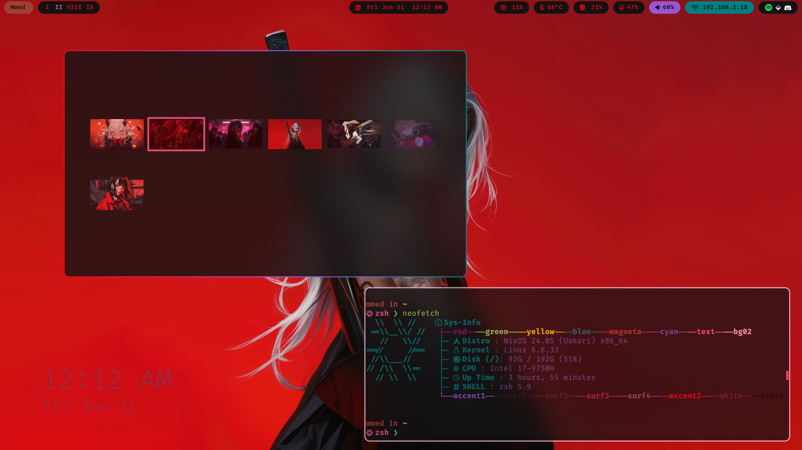
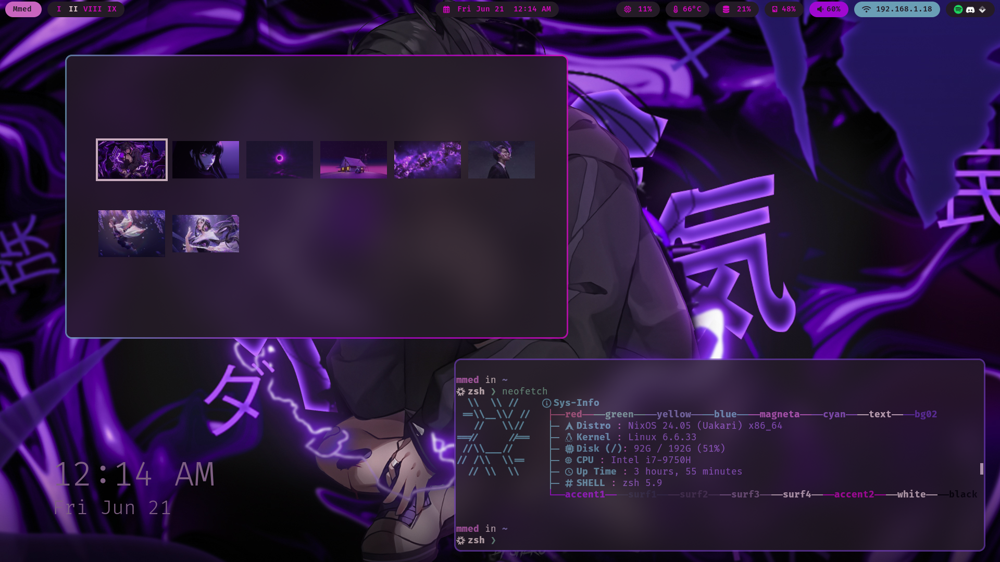
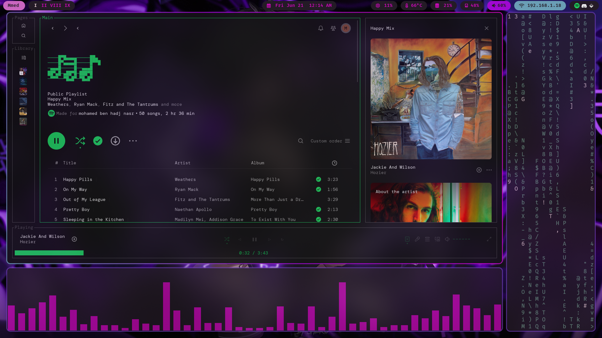
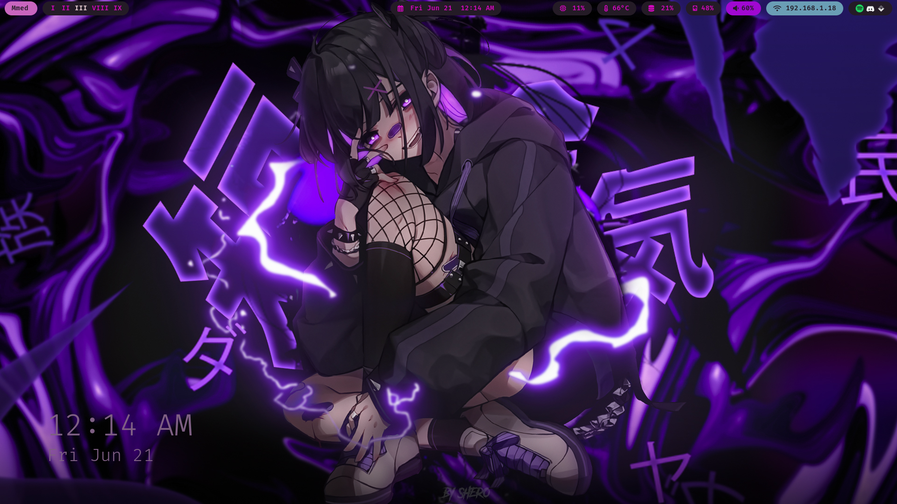
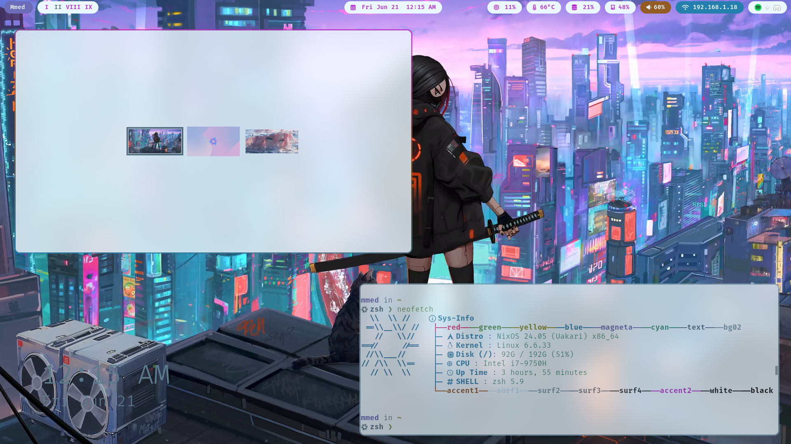
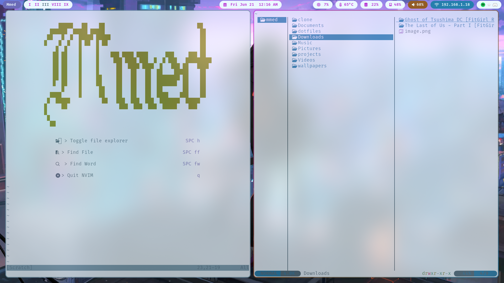

# Mmed's Nixos dotfiles

## Showcase

|  |  |  |
|--------------------------|--------------------------|--------------------------|
|  |  |  |
|--------------------------|--------------------------|--------------------------|
|  |  |  |

## Installation

do not install this i know it's nixos and it's supposed to be reproducible but I sacrificed that months ago and now I need magic to get it back.

## Usage

this repository can be helpfull to you with the config files and the scripts that I use to manage my system. I believe my dotfiles are modular enough so that you can find what you are looking for.
In case you are rightfully confused by the structure of this repository, feel free to contact me and I will try to help you. feel free to use make an issue to ask for help or give a recommendation.

## structure

- `config_files` contains most of the configuration files that are symlinked to the .config folder in the [home.nix](./user/home.nix) file (this is done because to I refuse to do double configuration).
- `system` contains the most basic applications needed for this to work.
- `user` contains all the home manager files and the home.nix file that is used to configure the user environment.

## Theming

Theming is mostly done in the [theming.nix](./user/theming.nix) file.
for it to work I have a folder in my home directory called `wallpapers` that contains the wallpapers that can be found in [this repo](https://github.com/mmed-hajnasr/wallpapers).
And in the folder there is a single file called aux.json that stores the current wallpaper for each theme.
